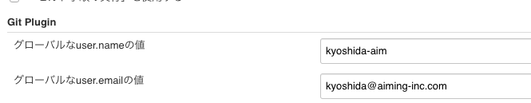

https://qiita.com/mokuo/items/4a7db562fcb7f8939a8b#jenkinsプラグインのインストール  
Jenkins自体の設定は基本編でやっているので省略  
アカウントは会社のものを使う(出ないとリポジトリにアクセスできない)  
プラグインのインストールから行う  

Rake plugin  
rbenv plugin  
GitHub pull request builder  
以上三点のPluginを入れる  

GitPluginの設定  

~
リポジトリのProtectRule設定
[参考](https://help.github.com/en/articles/configuring-protected-branches)
対象のリポジトリを開く
`Settings` → `Branches` → `Branch protectionrules` の右にある `Add　rule` ボタンを押す

`Branch name pattern` : ルールを適用するブランチ名(ここではmasterのみとする)

｀Rule settings` から保護設定をする
ここでは~

GitHubアカウントのSettingsを開く(GitHub右上にある自分のアイコンから選択できる)

`Developer settings` → `Personal access tokens` → `Generate new token`

`Note` に用途を記入し、 `Select scopes` からトークンの権限を設定する(ここではrepoのみにチェックを入れる)

注意
`Generate Token` ボタンを押した後に出るトークンが表示されるのは　一度のみ
ローカルに保存するかメモ書きをしておくことをオススメするが、その際は GitHub上に上げないこと
トークンが流出すれば悪用される恐れもある。

Jenkinsのホームから
`Jenkinsの管理` → `システムの設定` → `GitHub Pull Request Builder` の設定を行う
[設定例](Images/Crendentials)
`GitHub Server API URL` は今回は変えずとも良い
`Credentials` に認証情報を追加する
`種類` : Secret text
`Secret` : GitHubで生成したアクセストークン

先ほど設定した認証情報を使って接続テストを行う
[設定例2](Images/GHPRB_Settings)
`Test basic connection to GitHub` にチェックを入れて右側に現れる `Connect to API` を押してログインできれば成功

自動ビルドを行うジョブを作成する
`新規ジョブ作成` (名前は任意) → `フリースタイル・プロジェクトのビルド`
作成したジョブの設定を開く

`General`
`GitHub project` にチェック→リポジトリのURLを入力

`古いビルドの破棄`  
必須ではないが有効にしてもいい
ビルドの保存日数は7日前後で良い

`ソースコード管理` : Gitを選択
リポジトリURLにリポジトリのURLを入力
(セキュリティ的にSSH接続のURLの方がいい？要検証)
高度な設定から `Refspec` を設定する
+refs/pull/*:refs/remotes/origin/pr/*

`ビルドするブランチ` →　`ブランチ指定子`:${sha1}

`ビルド・トリガー`
GitHub Pull Request Builder にチェックを入れる

Admin list に自分のアカウントを登録
`Use github hooks for build triggering` のチェックが入っていたら外す

`Trigger Setup` から `Update commit status druing build`を編集するとPR側に表示されるメッセージを変更できる

ビルド後の処理
必要であればSlack通知などを利用するといい

